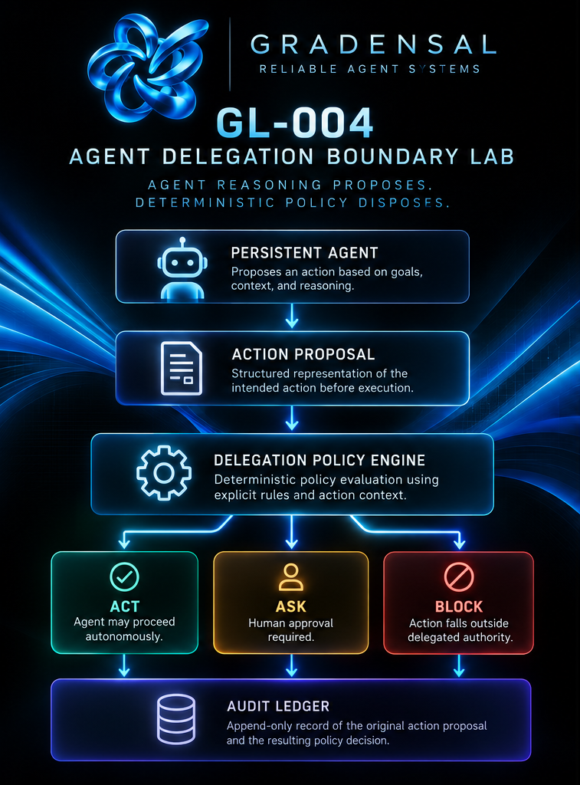
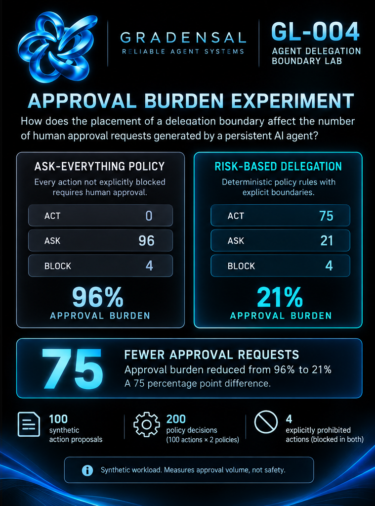
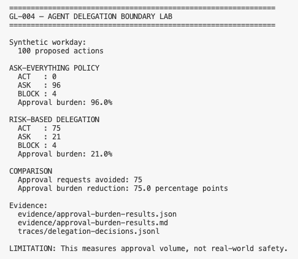

# GL-004 — Agent Delegation Boundary Lab

<p align="center">
  
</p>

<p align="center">
  <strong>A deterministic policy experiment for governing persistent AI agents through explicit ACT, ASK, and BLOCK delegation boundaries.</strong>
</p>

<p align="center">
  Gradensal Lab · Reliable Agent Systems
</p>

---

## Why I Built This

Persistent AI agents create a different governance problem from traditional
request-response assistants.

If an agent can continue working toward a goal while a human is elsewhere,
it eventually encounters a consequential question:

> Which actions may it perform autonomously, which should require human
> approval, and which should remain outside delegated authority?

GL-004 explores that boundary.

The prototype separates an agent's **intention to act** from its
**authority to execute**.

Every proposed action passes through a deterministic policy engine before it
can proceed.

The engine returns one of three decisions:

- **ACT** — the agent may proceed autonomously
- **ASK** — human approval is required
- **BLOCK** — the action falls outside delegated authority

---

## Research Question

How does the placement of a delegation boundary affect the number of human
approval requests generated by a persistent AI agent?

A second question follows:

> Does requiring human approval for everything create its own operational
> problem?

This project measures that problem as **approval burden**.

It does not attempt to measure human fatigue directly.

---

## Architecture

<p align="center">
  
</p>

```text
Persistent Agent
      |
      v
Action Proposal
      |
      v
Delegation Policy Engine
      |
      +--------+--------+
      |        |        |
     ACT      ASK     BLOCK
      |        |        |
      v        v        v
 Execute    Human     Reject
           Approval
      \        |        /
       \       |       /
        +------v------+
        Audit Ledger
```

The central architectural principle is:

> **Agent reasoning proposes. Deterministic policy disposes.**

An AI model may reason probabilistically about what it wants to do.

The final delegation decision remains separate and inspectable.

See [`docs/architecture.md`](docs/architecture.md) for the complete
architecture.

---

## Experiment

GL-004 runs the same deterministic **100-action synthetic workday** through
two different delegation policies.

### Policy A — Ask Everything

Every action that is not explicitly blocked requires human approval.

### Policy B — Risk-Based Delegation

Actions are evaluated using explicit policy rules and context.

The workload contains:

- 75 low-risk internal actions
- 20 consequential actions
- 1 previously unknown action
- 4 explicitly prohibited actions

Both policies receive the exact same action proposals.

---

## Results

<p align="center">
  
</p>

| Decision | Ask Everything | Risk-Based |
|---|---:|---:|
| ACT | 0 | 75 |
| ASK | 96 | 21 |
| BLOCK | 4 | 4 |
| Approval burden | 96% | 21% |

### Observed Difference

In this synthetic workload, risk-based delegation produced:

- **75 fewer approval requests**
- approval burden reduced from **96% to 21%**
- a **75 percentage-point difference**
- the same **4 explicitly prohibited actions blocked**

Across both scenarios, the experiment generated:

**200 auditable policy decisions**

### Important Limitation

These results measure **approval volume inside this prototype**.

They do **not** demonstrate that fewer approvals are inherently safer,
more effective, or appropriate for real organizations.

Real delegation policy depends on context, risk, regulation, organizational
controls, user behavior, and the consequences of incorrect autonomous action.

Full methodology:
[`docs/experiment.md`](docs/experiment.md)

Machine-readable evidence:
[`evidence/approval-burden-results.json`](evidence/approval-burden-results.json)

Human-readable evidence:
[`evidence/approval-burden-results.md`](evidence/approval-burden-results.md)

---

## Experiment Evidence

<p align="center">
  
</p>

---

## How the Policy Engine Works

An action is represented before execution.

Example:

```python
ActionProposal(
    agent_id="persistent-agent-demo",
    action="send_email",
    resource="external_email",
    external_effect=True,
)
```

The policy engine evaluates the proposal.

Possible result:

```text
Decision: ASK
Policy: APPROVAL-001
Reason: Configured consequential action requires approval.
```

Policy precedence intentionally evaluates higher-consequence conditions
before autonomous permissions.

Conceptually:

```text
Explicit BLOCK
     ↓
Credential effect
     ↓
Financial effect
     ↓
Configured approval
     ↓
External effect
     ↓
State change
     ↓
Sensitive data
     ↓
Configured autonomy
     ↓
Unknown action → ASK
```

Unknown actions therefore **fail closed to human review** rather than
receiving automatic authority.

---

## Auditability

Each evaluated action can be recorded as an append-only JSONL event containing:

- original action proposal
- resulting policy decision
- policy identifier
- policy version
- evaluation timestamp

The experiment produces 200 trace events.

Runtime traces are intentionally excluded from the public Git repository.

Summarized experiment evidence is committed instead.

---

## Project Structure

```text
.
├── models.py
├── policy.py
├── ledger.py
├── simulation.py
├── run_demo.py
├── policies.json
├── tests/
│   ├── test_policy.py
│   └── test_simulation.py
├── evidence/
│   ├── approval-burden-results.json
│   └── approval-burden-results.md
├── docs/
│   ├── architecture.md
│   └── experiment.md
├── assets/
│   ├── brand/
│   ├── diagrams/
│   ├── screenshots/
│   └── demo/
├── PROJECT.md
├── BUILD_LEDGER.md
├── requirements.txt
├── pyproject.toml
└── README.md
```

---

## Technology

**Python 3.12**

Core implementation and simulation.

**Pydantic 2**

Structured, validated action proposals and policy decisions.

**pytest 8**

Deterministic unit and experiment testing.

**JSON / JSONL**

Human-readable policy configuration and append-only audit traces.

**GitHub Actions**

Independent automated test execution on pushes and pull requests.

No LLM or external API is required to execute the core governance logic.

That is intentional.

The policy layer remains usable independently from any model provider.

---

## Run Locally

### 1. Clone

```bash
git clone https://github.com/Gradensal/gl-004-agent-delegation-boundary.git
cd gl-004-agent-delegation-boundary
```

### 2. Create a virtual environment

```bash
python3 -m venv .venv
source .venv/bin/activate
```

### 3. Install dependencies

```bash
python -m pip install -r requirements.txt
```

### 4. Run tests

```bash
python -m pytest -q
```

Current test suite:

```text
14 passed
```

### 5. Run the experiment

```bash
python run_demo.py
```

This recreates the synthetic 100-action comparison and writes local audit
traces plus summarized experiment evidence.

---

## Testing

The test suite covers:

- autonomous internal actions
- approval-required communications
- external effects
- financial effects
- sensitive data
- credential-changing actions
- explicitly blocked actions
- unknown actions
- policy precedence
- deterministic 100-action workload
- ask-everything baseline
- risk-based delegation
- JSONL audit logging

Tests also run automatically through GitHub Actions.

---

## Security and Governance Notes

This repository deliberately:

- uses synthetic actions only
- does not connect to live systems
- contains no production credentials
- does not delegate real financial authority
- excludes runtime traces from source control
- separates agent reasoning from policy authorization
- defaults unknown actions to human review

This is a prototype governance experiment rather than a production
authorization service.

---

## Limitations

A production system would require considerably more infrastructure,
including:

- authenticated agent identities
- principal-to-agent delegation
- signed or verifiable authorization
- authorization expiry
- revocation
- secure policy administration
- approval workflow infrastructure
- immutable or protected audit logs
- multi-tenant isolation
- policy conflict resolution
- rate and resource controls
- monitoring and incident response
- adversarial testing
- organization-specific risk policies

The synthetic policy weights and boundaries in GL-004 should therefore not be
treated as recommended enterprise policy.

---

## Reliable Agent Systems — Gradensal Lab

GL-004 is part of an evolving Gradensal research direction around reliable
agentic systems.

The broader questions include:

**Observability**  
What did the agent do?

**Authorization**  
What authority did the agent receive?

**Revocation**  
What happens when valid authority disappears during execution?

**Delegation**  
Which decisions may the agent make without returning to a human?

Together these experiments explore the infrastructure surrounding increasingly
autonomous AI systems.

---

## What I Learned

The interesting constraint in persistent-agent design is not simply whether a
human remains "in the loop."

The location and frequency of that human decision matter.

An architecture that asks for approval before every routine action may preserve
formal human control while creating so many interruptions that the approval
mechanism becomes operationally impractical.

That makes **human attention itself an architectural resource**.

GL-004 does not establish the correct delegation boundary.

It provides a reproducible way to make that design trade-off visible.

---

## Future Work

Possible extensions include:

- configurable financial thresholds
- time-limited delegated authority
- policy composition and precedence
- role-based policies
- signed delegation grants
- approval expiration
- revocation during execution
- resource budgets
- external policy engines
- Open Policy Agent integration
- real approval workflows
- integration with agent telemetry
- adversarial policy evaluation

---

## Project Status

**Prototype / Research Experiment**

Not production-ready.

---

## Author

**Lissette Gorrin Rodriguez**

AI Builder × Storyteller  
Founder, Gradensal

---

## License

MIT